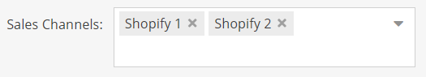

# Sync Shopify Bundle

Bundle Pimcore 11 per l'integrazione con IPaaS per la sincronizzazione di anagrafica, traduzioni e prezzi dei prodotti.

## Installazione

- Eseguire il comando `composer require sintra/pimcore-shopify-using-ipaas`
- Abilitare il bundle nel file `config/bundles.php`
  ``` php
  SyncShopifyBundle\SyncShopifyBundle::class => ['all' => true]
  ```
- Installare il bundle con il comando eseguito all'interno del
  container docker `bin/console pimcore:bundle:install SyncShopifyBundle`

## Utilizzo

L'installazione del bundle crea il dataobject `DefaultProduct` che è sincronizzabile tramite i mapper di default già
presenti nella libreria.
E' possibile creare dei mapper custom per il dataobject specifico che si intende mappare.

#### Creazione Mapper

Il mapper deve essere registrato come servizio nel `services.yaml`, non sono necessari tag perchè già presenti
nell'interfaccia implementata.

Per estendere la libreria con un mapper custom è necessario implementare l'interfaccia del flusso specifico:

- `SyncShopifyBundle\Service\Product\IShopifyProductMapper`
- `SyncShopifyBundle\Service\Translation\IShopifyTranslationMapper`
- `SyncShopifyBundle\Service\Price\IShopifyPriceMapper`

I metodi da implementare sono:

- `getMapperServiceKey()`: La chiave passata come query parameter `mapper-service-key` nella chiamata agli endpoint, per
  scegliere il servizio corretto di mappatura
- `getProductClassId()`: La classe del dataobject pimcore del prodotto
- `getShopifyChannelKey()`: La chiave del canale di vendita Shopify, necessaria per filtrare i prodotti da esportare. Il
  prodotto ha nella tab `Synchronization Information` una multiselect in cui è possibile selezionare le istanze Shopify
  in cui esportarlo.
  
- `getMappedProduct()`: Restituisce il modello specifico del flusso mappato con il prodotto, è possibile escludere il
  dataobject lanciando l'eccezione `IgnoreDataObjectMappingException`

#### Query Prodotti

I prodotti sono selezionati in base alla `modificationDate` con ordinamento crescente. Onde evitare la selezione dei
medesimi prodotti ogni volta, è salvata l'ultima `modificationDate` nella tabella settings_store a DB.
Sono selezionati solo i prodotti `published` e che sono esportabili per un certo canale Shopify.
Sul modello mappato viene effettuato un hash, salvato sulle note del dataObject e confrontato con l'ultimo calcolato per
evitare l'invio di un messaggio duplicato ad IPaaS.

## Sicurezza

Nel bundle è configurato un Authenticator Symfony per proteggere gli endpoint tramite un API Key.

- Inserire l'API Key nel file `.env` oppure nell'environment del `docker-compose.yaml`
  ``` yaml
   SYNC_SHOPIFY_BUNDLE_API_KEY: your-api-key
  ```

- Aggiungere la configurazione nel file `config/packages/security.yaml`

  ``` yaml
  security:
    firewalls:
      sync-shopify:
        pattern: ^/sync-shopify
        stateless: true
        custom_authenticators:
          - SyncShopifyBundle\Security\ApiKeyAuthenticator
   
    access_control:
      - { path: ^/sync-shopify, roles: IS_AUTHENTICATED_FULLY }
  ```
  All'occorrenza è possibile utilizzare un Authenticator custom sostituendo quello presente.